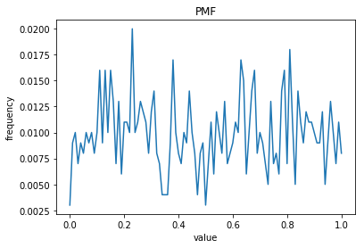
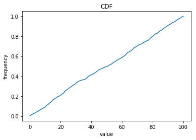

[Think Stats Chapter 4 Exercise 2](http://greenteapress.com/thinkstats2/html/thinkstats2005.html#toc41) (a random distribution)

My Code -

```python
import random
import pandas as pd
import matplotlib.pyplot as plt

rand_nums = []
for i in range(0,1000):
    rand_nums.append(random.random())

rounded_rand_nums = pd.DataFrame([round(i,0)/100 for i in np.array(rand_nums)*100])
counts = rounded_rand_nums[0].value_counts().sort_index()
freqs = counts/sum(counts)

cdf = []
cum_prob = 0
for i in freqs:
    cum_prob += i
    cdf.append(cum_prob)
    
plt.plot(freqs)
plt.xlabel('value')
plt.ylabel('frequency')
plt.title('PMF')
plt.show()
plt.plot(cdf)
plt.xlabel('value')
plt.ylabel('frequency')
plt.title('CDF')
plt.show()
```

My Results -

While not completely uniform, it looks to be close enough.  The CDF is more or less an upward sloping straight line.



